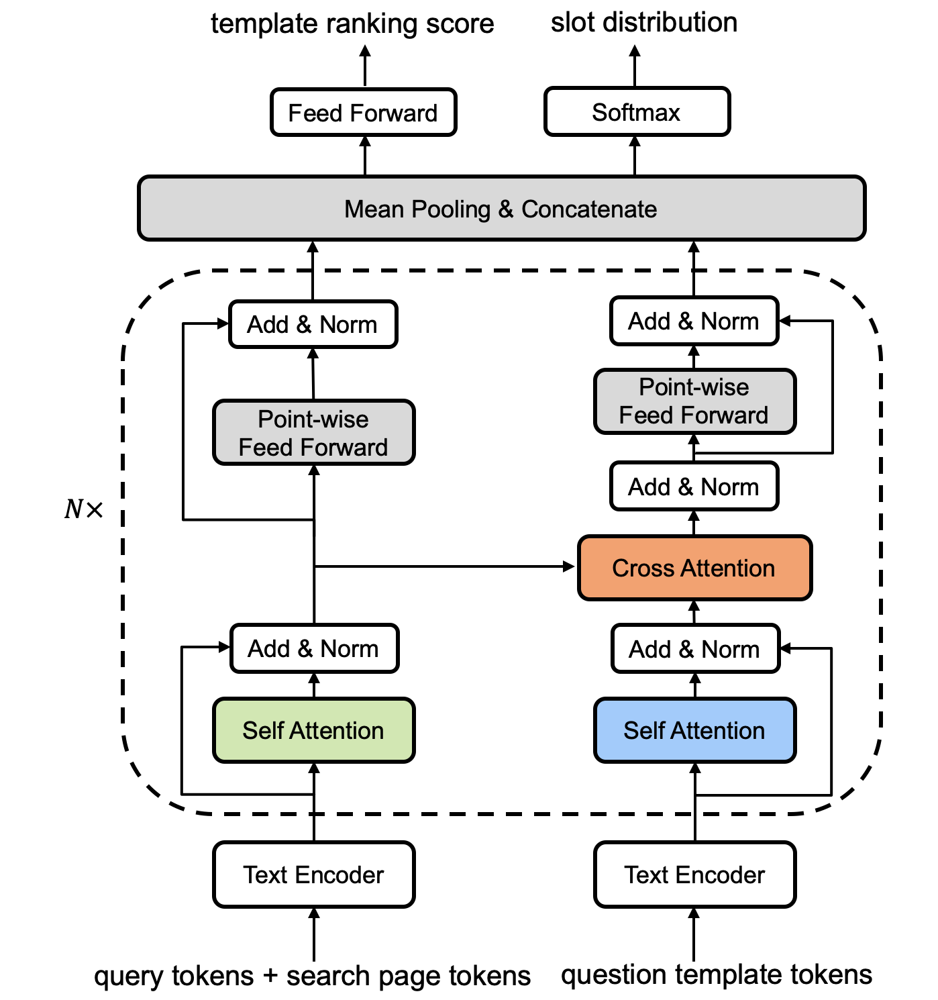

# NeurClariQ
This repository contains data and code for ...

In this paper, we formulate the task of generating clarifying questions for Web search by jointly learning to select question templates and fill question slots, and propose a novel neural clarifying question generation model, called NeurClariQ, using Transformer-based networks. The overall architecture is illustrated as below:
<p align="center">

</p>


## Requirements
The implementation is based on Python 3.x. To install the dependencies, please run:
```
pip install -r requirements.txt
```
Note: Running `RankLib.jar` needs Java runtime environment.

The pre-trained BERT model can be downloaded from Hugging Face [model card](https://huggingface.co/bert-base-uncased/tree/main), please download `config.json`, `pytorch_model.bin`, `vocab.txt` and place these files into the folder `pretrain/bert/base-uncased/`. The pre-trained Glove word vectors can be downloaded from [here](http://nlp.stanford.edu/data/glove.42B.300d.zip), and unzip the file into `glove.42B.300d.txt`.

## Quickstart

### Training
For LSTM-based encoder, please first set the parameters in the script `run_train_lstm.sh`, then run:
```
sh run_train_lstm.sh
```
For BERT-based encoder, please first set the parameters in the script `run_train_bert.sh`, then run:
```
sh run_train_bert.sh
```

### Testing
Please first set the parameters in the script `run_test.sh`, then run:
```
sh run_test.sh
```

### Evaluation
Please first set the parameters in the script `run_eval.sh`. Note that `--eval_metric` should be set within `Acc`, `MRR`, `BLEU`, and `Entity-F1`, `--eval_file` should specify the generated output file of each model. Run:
```
sh run_eval.sh
```


## Citation
If you find our repo useful, you can cite our paper as: