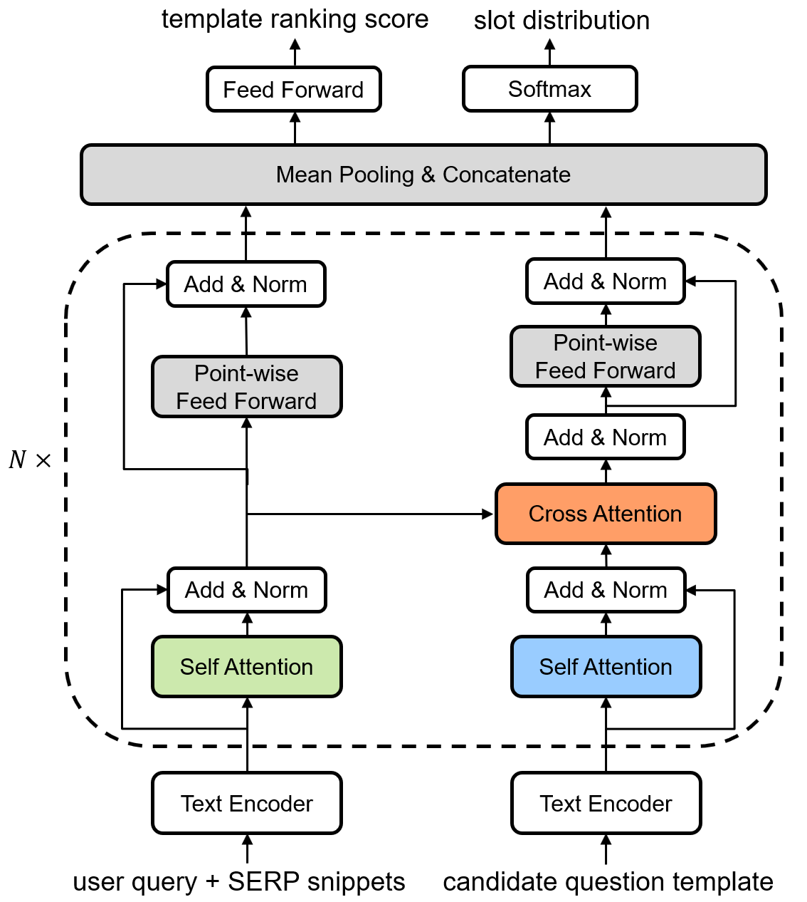

# TG-ClariQ
This repository contains code and data for the short paper "[Template-guided Clarifying Question Generation for Web Search Clarification](https://iwangjian.github.io/pdf/CIKM2021.wang.pdf)" (CIKM'2021).

In this paper, we frame the task of asking clarifying questions for Web search clarification as the unified problem of question template selection and slot generation, with the objective of jointly learning to select the question template from a list of template candidates and fill in the question slot from a slot vocabulary. We investigate a simple yet effective Template-Guided Clarifying Question generation model (TG-ClariQ), the architecture of which is shown as below:
<p align="center">

</p>


## Requirements
The implementation is based on Python 3. To install the dependencies, please run:
```
pip install -r requirements.txt
```
Note: The `RankLib.jar` in the baseline models (RankNet and LambdaMART) needs Java runtime environment.

The pre-trained BERT model can be downloaded from Hugging Face's [model card](https://huggingface.co/bert-base-uncased/tree/main), please download `config.json`, `pytorch_model.bin`, `vocab.txt` and place these files into the folder `pretrain/bert/base-uncased/`. The pre-trained Glove word vectors can be downloaded from [here](http://nlp.stanford.edu/data/glove.42B.300d.zip), then unzip the file as `glove.42B.300d.txt` and place into the folder `pretrain/glove/`.

## Dataset
We have uploaded the preprocessed MIMICS dataset to the `data/` folder, where the `MIMICS-train.zip` needs to be unzipped. For more details about the raw MIMICS data collection, please refer to the Microsoft [MIMICS](https://github.com/microsoft/MIMICS) repo.

## Quickstart

### Training
For the LSTM-based encoder, please first set the parameters in the script `run_train_lstm.sh`, then run:
```
sh run_train_lstm.sh
```
For the BERT-based encoder, please first set the parameters in the script `run_train_bert.sh`, then run:
```
sh run_train_bert.sh
```

### Testing
Please first set the parameters in the script `run_test.sh`, then run:
```
sh run_test.sh
```

### Evaluation
Please first set the parameters in the script `run_eval.sh`. Note that `--eval_metric` should be set within `ACC`, `MRR`, `BLEU`, and `Entity-F1`, `--eval_file` should specify the generated output file of each model. Please run:
```
sh run_eval.sh
```

## Acknowledgments
Our implementation of the RankNet and LambdaMART is based on the [RankLib](https://sourceforge.net/p/lemur/wiki/RankLib/), the Seq2Seq is based on the [OpenNMT](https://github.com/OpenNMT/OpenNMT-py). We thank the [Hugging Face Transformers](https://github.com/huggingface/transformers) for the pretrained models and high-quality code.


## Citation
If you find our code is helpful in your work, you can cite our paper as:
```
@inproceedings{wang2021template,
  title = {Template-guided Clarifying Question Generation for Web Search Clarification},
  author = {Wang, Jian and Li, Wenjie},
  booktitle = {Proceedings of the 30th ACM International Conference on Information and Knowledge Management (CIKM'21)},
  year = {2021},
  pages = {3468–3472},
}
```